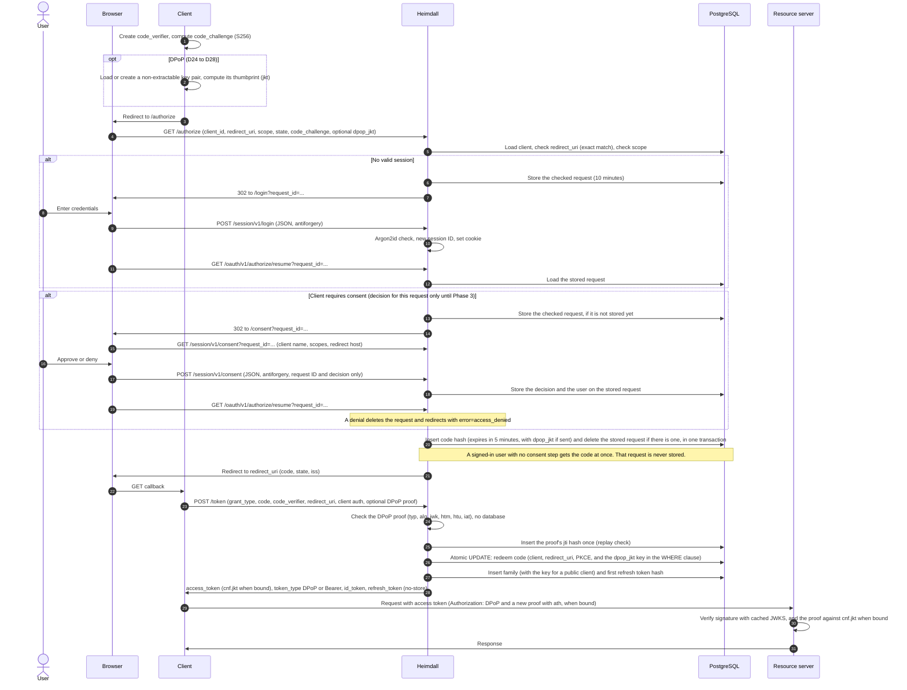
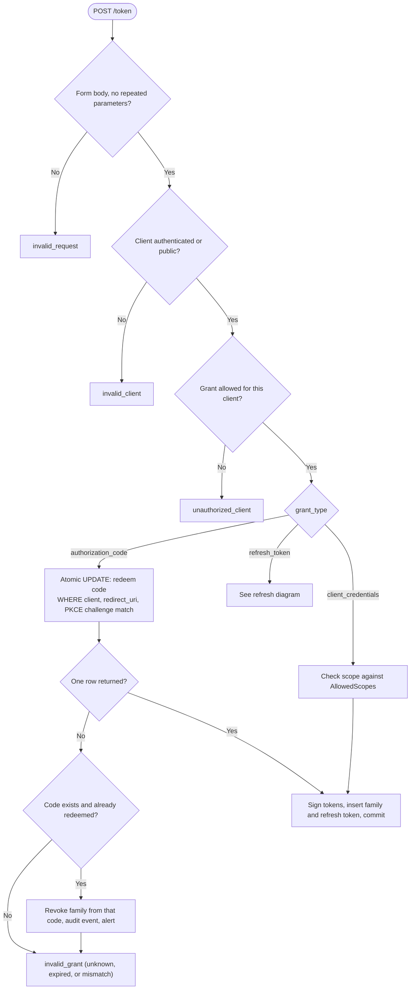

# 02 Authorization code flow with PKCE

## Full flow

```mermaid
sequenceDiagram
    autonumber
    actor U as User
    participant B as Browser
    participant C as Client
    participant H as Heimdall
    participant DB as PostgreSQL
    participant R as Resource server

    C->>C: Create code_verifier, compute code_challenge (S256)
    opt DPoP (D24 to D28)
        C->>C: Load or create a non-extractable key pair, compute its thumbprint (jkt)
    end
    C->>B: Redirect to /authorize
    B->>H: GET /authorize (client_id, redirect_uri, scope, state, code_challenge, optional dpop_jkt)
    H->>DB: Load client, check redirect_uri (exact match), check scope
    alt No valid session
        H->>DB: Store the checked request (10 minutes)
        H->>B: 302 to /login?request_id=...
        U->>B: Enter credentials
        B->>H: POST /session/v1/login (JSON, antiforgery)
        H->>H: Argon2id check, new session ID, set cookie
        B->>H: GET /oauth/v1/authorize/resume?request_id=...
        H->>DB: Load the stored request
    end
    alt Client requires consent (decision for this request only until Phase 3)
        H->>DB: Store the checked request, if it is not stored yet
        H->>B: 302 to /consent?request_id=...
        B->>H: GET /session/v1/consent?request_id=... (client name, scopes, redirect host)
        U->>B: Approve or deny
        B->>H: POST /session/v1/consent (JSON, antiforgery, request ID and decision only)
        H->>DB: Store the decision and the user on the stored request
        B->>H: GET /oauth/v1/authorize/resume?request_id=...
        Note over H: A denial deletes the request and redirects with error=access_denied
    end
    H->>DB: Insert code hash (expires in 5 minutes, with dpop_jkt if sent) and delete the stored request if there is one, in one transaction
    Note over H,DB: A signed-in user with no consent step gets the code at once. That request is never stored.
    H->>B: Redirect to redirect_uri (code, state, iss)
    B->>C: GET callback
    C->>H: POST /token (grant_type, code, code_verifier, redirect_uri, client auth, optional DPoP proof)
    H->>H: Check the DPoP proof (typ, alg, jwk, htm, htu, iat), no database
    H->>DB: Insert the proof's jti hash once (replay check)
    H->>DB: Atomic UPDATE: redeem code (client, redirect_uri, PKCE, and the dpop_jkt key in the WHERE clause)
    H->>DB: Insert family (with the key for a public client) and first refresh token hash
    H->>C: access_token (cnf.jkt when bound), token_type DPoP or Bearer, id_token, refresh_token (no-store)
    C->>R: Request with access token (Authorization: DPoP and a new proof with ath, when bound)
    R->>R: Verify signature with cached JWKS, and the proof against cnf.jkt when bound
    R->>C: Response
```

## Decisions made at /token

```mermaid
flowchart TD
    S(["POST /token"]) --> F{"Form body, no repeated parameters?"}
    F -- No --> E1["invalid_request"]
    F -- Yes --> CA{"Client authenticated or public?"}
    CA -- No --> E2["invalid_client"]
    CA -- Yes --> G{"Grant allowed for this client?"}
    G -- No --> E3["unauthorized_client"]
    G -- Yes --> GT{"grant_type"}
    GT -- authorization_code --> RC["Atomic UPDATE: redeem code<br/>WHERE client, redirect_uri, PKCE challenge match"]
    GT -- refresh_token --> RT["See refresh diagram"]
    GT -- client_credentials --> SC["Check scope against AllowedScopes"]
    RC --> OK1{"One row returned?"}
    OK1 -- No --> RU{"Code exists and already redeemed?"}
    RU -- Yes --> REV["Revoke family from that code, audit event, alert"]
    RU -- No --> E4["invalid_grant (unknown, expired, or mismatch)"]
    REV --> E4
    OK1 -- Yes --> ISS["Sign tokens, insert family and refresh token, commit"]
    SC --> ISS
```

Every `invalid_grant` looks the same to the caller (D5). Only the audit log has the real reason.
