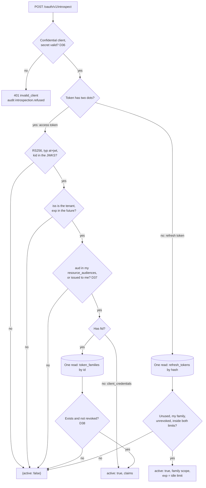

# Introspection

The design is D36 to D39 in `docs/threat-model.md`. Every "no" ends with the same answer, `{"active": false}`, so the caller cannot tell why.

```mermaid
flowchart TD
    R[POST /oauth/v1/introspect] --> A{Confidential client,<br/>secret valid? D36}
    A -- no --> E[401 invalid_client<br/>audit introspection.refused]
    A -- yes --> K{Token has two dots?}
    K -- yes: access token --> V{RS256, typ at+jwt,<br/>kid in the JWKS?}
    V -- no --> N["{active: false}"]
    V -- yes --> I{iss is the tenant,<br/>exp in the future?}
    I -- no --> N
    I -- yes --> M{aud in my resource_audiences,<br/>or issued to me? D37}
    M -- no --> N
    M -- yes --> F{Has fid?}
    F -- no: client_credentials --> Y[active: true, claims]
    F -- yes --> G[(One read: token_families by id)]
    G --> H{Exists and not revoked? D38}
    H -- no --> N
    H -- yes --> Y
    K -- no: refresh token --> T[(One read: refresh_tokens by hash)]
    T --> U{Unused, my family,<br/>unrevoked, inside both limits?}
    U -- no --> N
    U -- yes --> Z[active: true, family scope,<br/>exp = idle limit]
```
