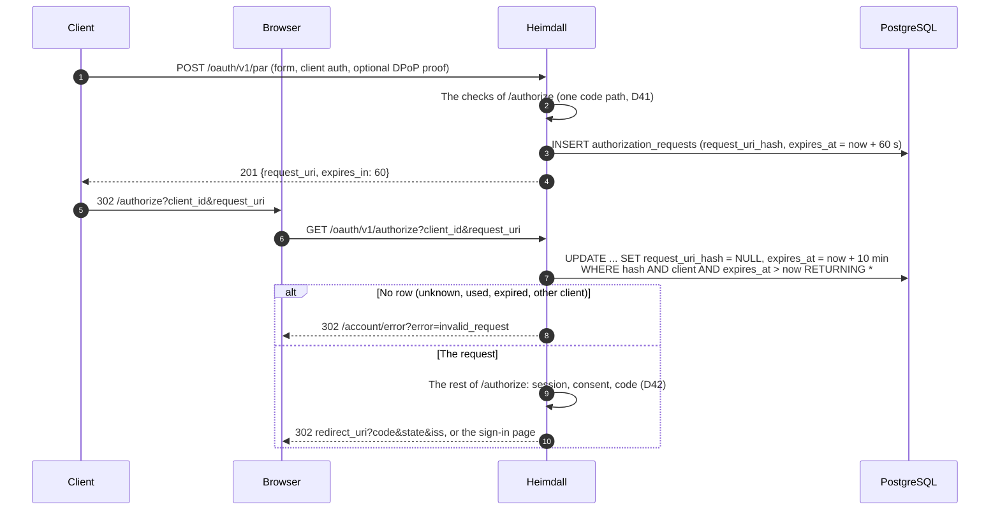

# Pushed authorization requests

The design is D40 to D43 in `docs/threat-model.md`. The statement is "Take a pushed request" in `docs/schema-design.md`.

```mermaid
sequenceDiagram
    autonumber
    participant C as Client
    participant B as Browser
    participant H as Heimdall
    participant DB as PostgreSQL

    C->>H: POST /oauth/v1/par (form, client auth, optional DPoP proof)
    H->>H: The checks of /authorize (one code path, D41)
    H->>DB: INSERT authorization_requests (request_uri_hash, expires_at = now + 60 s)
    H-->>C: 201 {request_uri, expires_in: 60}
    C->>B: 302 /authorize?client_id&request_uri
    B->>H: GET /oauth/v1/authorize?client_id&request_uri
    H->>DB: UPDATE ... SET request_uri_hash = NULL, expires_at = now + 10 min<br/>WHERE hash AND client AND expires_at > now RETURNING *
    alt No row (unknown, used, expired, other client)
        H-->>B: 302 /account/error?error=invalid_request
    else The request
        H->>H: The rest of /authorize: session, consent, code (D42)
        H-->>B: 302 redirect_uri?code&state&iss, or the sign-in page
    end
```
